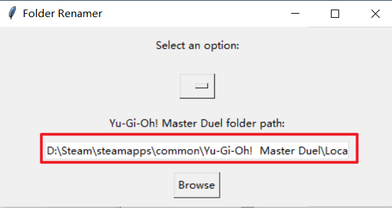

# YuGiOh-文件名修改

#### 介绍
steam玩YuGiOh，如果有大量自抽号，需要频繁切换账号的话，可以使用该脚本一键修改目录名称，实现快速切号

#### 使用说明

1.  打开软件，修改对应的游戏目录，到LocalData即可 

2.  打开目录下的YuGiOh.txt，填入你的卡组+游戏文件夹代码，参照原本就有的
3.  打开软件就可以用了

#### 特技

1.  使用 Readme\_XXX.md 来支持不同的语言，例如 Readme\_en.md, Readme\_zh.md
2.  Gitee 官方博客 [blog.gitee.com](https://blog.gitee.com)
3.  你可以 [https://gitee.com/explore](https://gitee.com/explore) 这个地址来了解 Gitee 上的优秀开源项目
4.  [GVP](https://gitee.com/gvp) 全称是 Gitee 最有价值开源项目，是综合评定出的优秀开源项目
5.  Gitee 官方提供的使用手册 [https://gitee.com/help](https://gitee.com/help)
6.  Gitee 封面人物是一档用来展示 Gitee 会员风采的栏目 [https://gitee.com/gitee-stars/](https://gitee.com/gitee-stars/)
